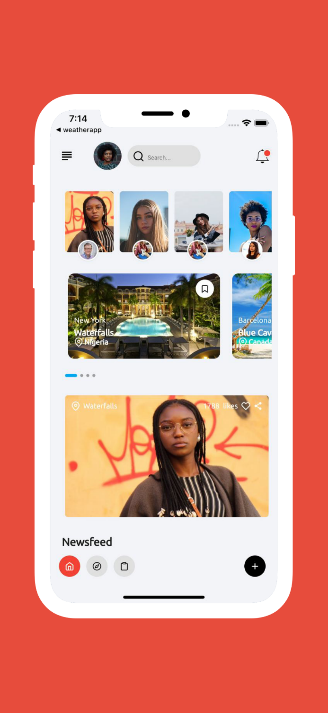
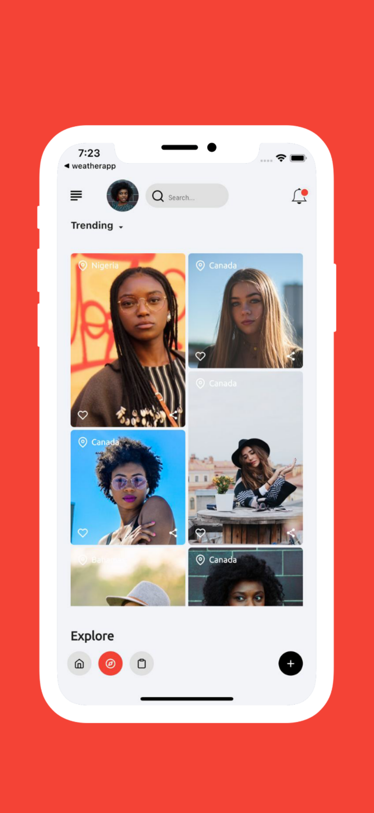
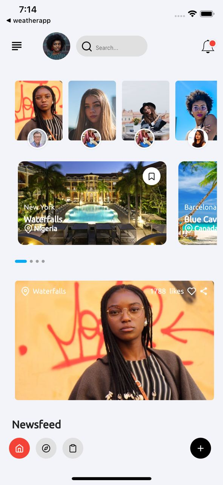
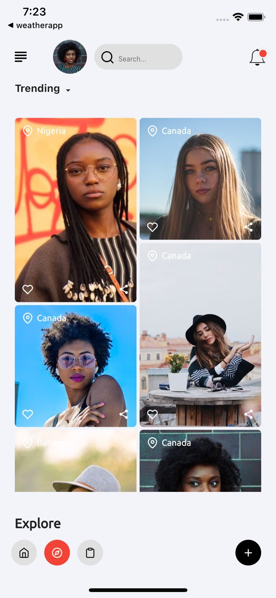
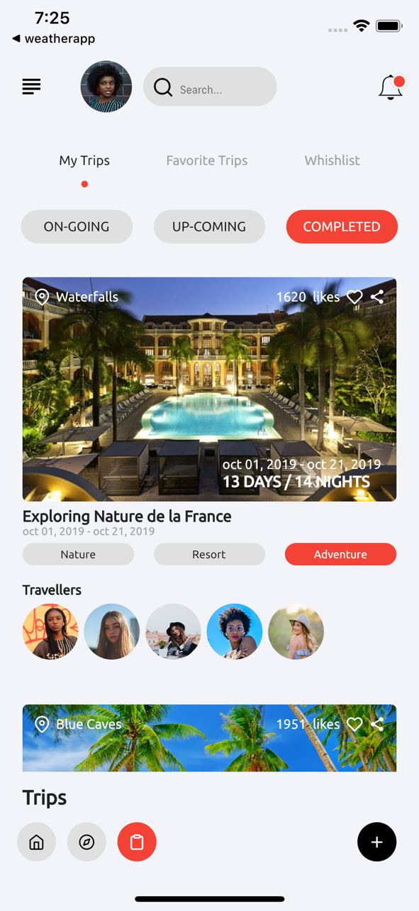
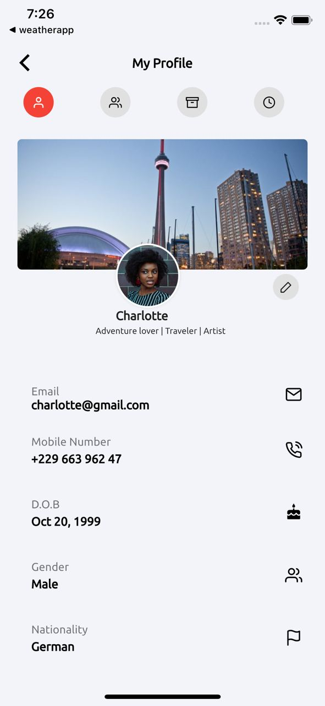
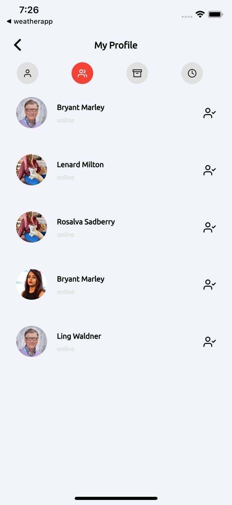

# 🔥🔥 Flutter Traveler's Social App  
Flutter representation of the Traveler's Social App.

## ✨ Requirements
* Any Operating System (ie. MacOS X, Linux, Windows)
* Any IDE with Flutter SDK installed (ie. IntelliJ, Android Studio, VSCode etc)
* A little knowledge of Dart and Flutter

## 🌗 Toggle theme
To toggle the theme, change the `theme` variable in `main.dart`.

`Constants.darkTheme` for dark and `Constants.lightTheme` for light.

## 📸 ScreenShots

 
 
